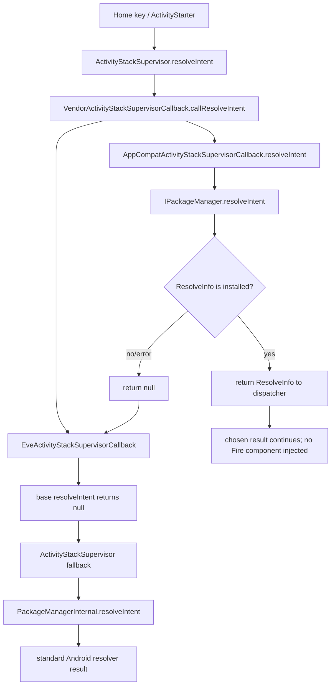

# Phase 6AL HOME callback graph

flowchart TD
  A[Home key / ActivityStarter] --> B[ActivityStackSupervisor.resolveIntent]
  B --> C[VendorActivityStackSupervisorCallback.callResolveIntent]
  C --> D[AppCompatActivityStackSupervisorCallback.resolveIntent]
  D --> E[IPackageManager.resolveIntent]
  E --> F{ResolveInfo is installed?}
  F -->|yes| G[return ResolveInfo to dispatcher]
  F -->|no/error| H[return null]
  C --> I[EveActivityStackSupervisorCallback]
  I --> J[base resolveIntent returns null]
  H --> I
  J --> K[ActivityStackSupervisor fallback]
  K --> L[PackageManagerInternal.resolveIntent]
  G --> M[chosen result continues; no Fire component injected]
  L --> N[standard Android resolver result]
