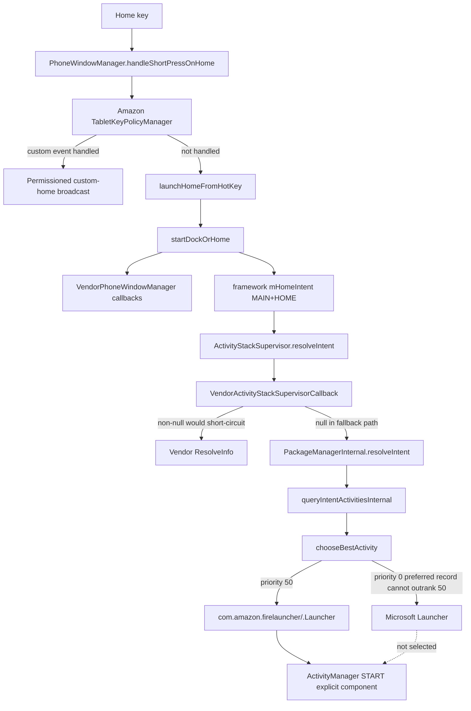

# HOME resolution call path (Phase 3B)

## Text form

1. `PhoneWindowManager.handleShortPressOnHome()` calls the Amazon key-policy
   hook. If it does not consume the key, framework `launchHomeFromHotKey()`
   reaches `startDockOrHome()`.
2. `startDockOrHome()` checks a custom dock intent, then Amazon vendor callbacks,
   then starts the framework `mHomeIntent` as the current user.
3. For a non-explicit MAIN+HOME intent, ActivityManager/ActivityTaskManager
   reaches `ActivityStackSupervisor.resolveIntent()`.
4. Fire OS calls `VendorActivityStackSupervisorCallback.callResolveIntent()`
   before PackageManagerInternal. A non-null callback result would short-circuit
   the standard resolver; no Fire-specific non-null result is present in the
   inspected callback evidence.
5. PackageManager runs `resolveIntentInternal()` →
   `queryIntentActivitiesInternal()` → `chooseBestActivity()`.
6. The candidate list includes Fire (effective priority 50), Microsoft (0), and
   FallbackHome (-1000). Fire wins the leading comparison before an ordinary
   priority-0 preferred record can become the result.
7. ActivityManager sets the selected component explicitly and starts Fire.

## What is confirmed versus unresolved

- Confirmed: the callback boundaries exist and the normal PM resolver is the
  fallback path.
- Confirmed: clean explicit capture has an explicit Fire START record; the clean
  keyevent capture has the same explicit Fire component in `am_new_intent` and
  final activity/window dumps.
- Strong evidence: current resolution is explained by AOSP-shaped priority
  ordering.
- Unconfirmed: whether any concrete callback returns a Fire `ResolveInfo` for
  this exact HOME intent before PM.
- Unknown: whether a background service rewrites preferred state after a future
  mutation; no new mutation or reboot was run in Phase 3B.

## Mermaid

