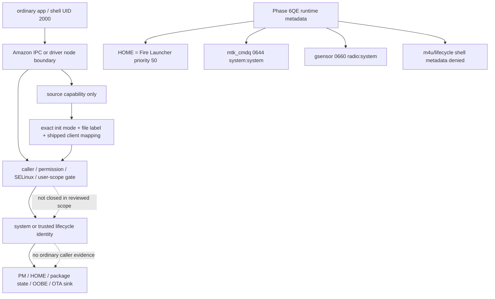

# Phase 6QE privilege-surface graph

Text interpretation: source capability is not a caller path. A usable privilege
route would still require the exact node/service publication, accepted caller and
SELinux/permission gate, identity transition, user scope, and a sensitive sink.
