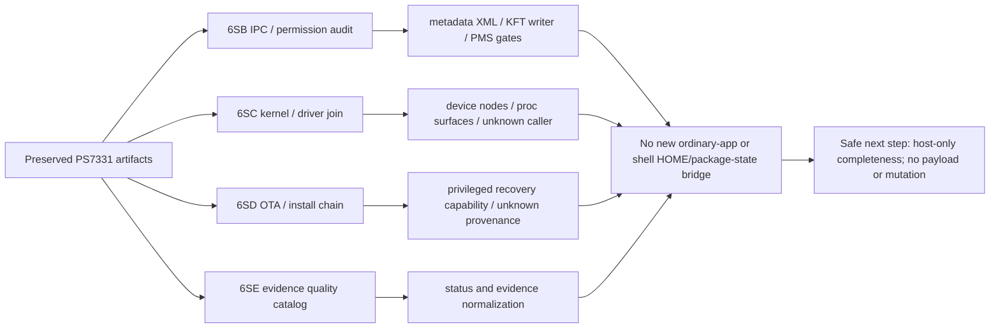

# Phase 6SB–SE control-surface graph



Text form:

```text
preserved PS7331 artifacts
  ├─ 6SB IPC/permission -> metadata/KFT writers -> PMS gates
  ├─ 6SC kernel/driver -> device/proc surfaces -> caller mostly UNKNOWN
  ├─ 6SD OTA/install -> privileged recovery capability -> provenance UNKNOWN
  └─ 6SE catalog -> status/evidence normalization
          └─ no new ordinary-app or shell HOME/package-state bridge
```
