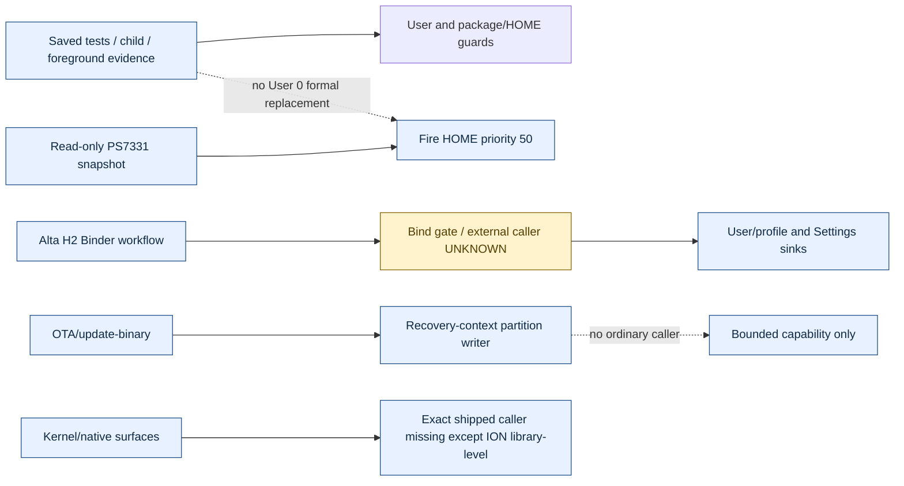

# Phase 6TE–TH control-surface graph

```mermaid
flowchart LR
  T["Saved tests / child / foreground evidence"] --> G["User and package/HOME guards"]
  R["Read-only PS7331 snapshot"] --> H["Fire HOME priority 50"]
  I["Alta H2 Binder workflow"] --> P["Bind gate / external caller UNKNOWN"]
  P --> U["User/profile and Settings sinks"]
  O["OTA/update-binary"] --> W["Recovery-context partition writer"]
  W -. "no ordinary caller" .-> X["Bounded capability only"]
  K["Kernel/native surfaces"] --> N["Exact shipped caller missing except ION library-level"]
  T -. "no User 0 formal replacement" .-> H
  classDef bound fill:#e8f1ff,stroke:#1d4e89,color:#102a43;
  classDef unknown fill:#fff3cd,stroke:#856404,color:#533f03;
  class T,R,H,I,U,O,W,X,K,N bound;
  class P unknown;
```
