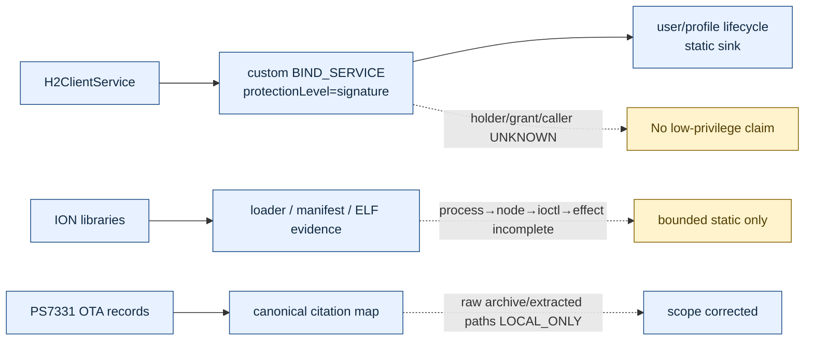

# Phase 6TM control-surface graph

```mermaid
flowchart LR
  H["H2ClientService"] --> P["custom BIND_SERVICE
protectionLevel=signature"]
  P --> U["user/profile lifecycle
static sink"]
  P -. "holder/grant/caller UNKNOWN" .-> X["No low-privilege claim"]
  I["ION libraries"] --> L["loader / manifest / ELF evidence"]
  L -. "process→node→ioctl→effect incomplete" .-> Y["bounded static only"]
  O["PS7331 OTA records"] --> C["canonical citation map"]
  C -. "raw archive/extracted paths LOCAL_ONLY" .-> R["scope corrected"]
  classDef bound fill:#e8f1ff,stroke:#1d4e89,color:#102a43;
  classDef unknown fill:#fff3cd,stroke:#856404,color:#533f03;
  class H,P,U,I,L,O,C,R bound;
  class X,Y unknown;
```
