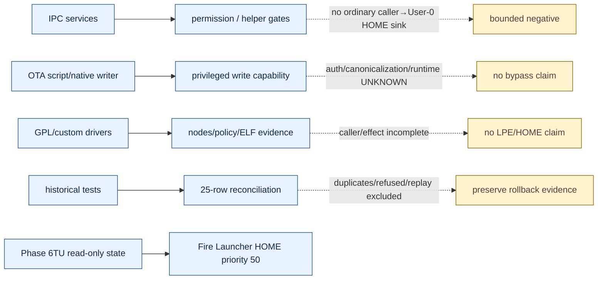

# Phase 6TV control-surface graph

```mermaid
flowchart LR
  I["IPC services"] --> IG["permission / helper gates"]
  IG -. "no ordinary caller→User-0 HOME sink" .-> IX["bounded negative"]
  O["OTA script/native writer"] --> OW["privileged write capability"]
  OW -. "auth/canonicalization/runtime UNKNOWN" .-> OX["no bypass claim"]
  D["GPL/custom drivers"] --> DP["nodes/policy/ELF evidence"]
  DP -. "caller/effect incomplete" .-> DX["no LPE/HOME claim"]
  T["historical tests"] --> R["25-row reconciliation"]
  R -. "duplicates/refused/replay excluded" .-> RX["preserve rollback evidence"]
  S["Phase 6TU read-only state"] --> H["Fire Launcher HOME priority 50"]
  classDef bound fill:#e8f1ff,stroke:#1d4e89,color:#102a43;
  classDef unknown fill:#fff3cd,stroke:#856404,color:#533f3f;
  class I,IG,O,OW,D,DP,T,R,S,H bound;
  class IX,OX,DX,RX unknown;
```
