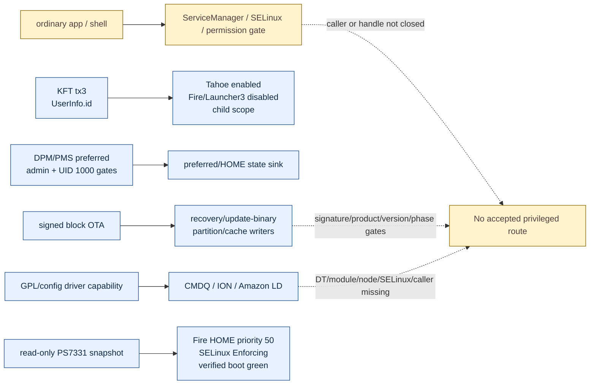

# Phase 6UM control-surface graph

```mermaid
flowchart LR
  A["ordinary app / shell"] --> B["ServiceManager / SELinux / permission gate"]
  B -. "caller or handle not closed" .-> X["No accepted privileged route"]
  K["KFT tx3
UserInfo.id"] --> K2["Tahoe enabled
Fire/Launcher3 disabled
child scope"]
  D["DPM/PMS preferred
admin + UID 1000 gates"] --> H["preferred/HOME state sink"]
  O["signed block OTA"] --> O2["recovery/update-binary
partition/cache writers"]
  O2 -. "signature/product/version/phase gates" .-> X
  G["GPL/config driver capability"] --> G2["CMDQ / ION / Amazon LD"]
  G2 -. "DT/module/node/SELinux/caller missing" .-> X
  R["read-only PS7331 snapshot"] --> R2["Fire HOME priority 50
SELinux Enforcing
verified boot green"]
  classDef bound fill:#e8f1ff,stroke:#1d4e89,color:#102a43;
  classDef unknown fill:#fff3cd,stroke:#856404,color:#533f3f;
  class K,K2,D,H,O,O2,G,G2,R,R2 bound;
  class A,B,X unknown;
```
