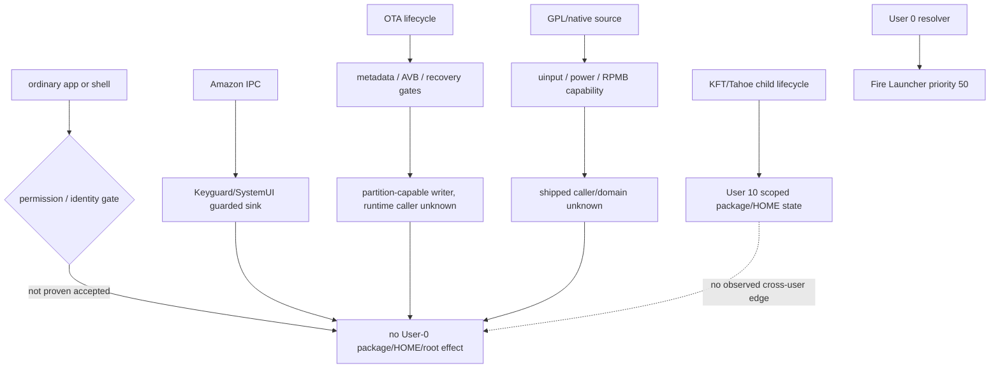

# Phase 6X control-surface graph

The Mermaid source is preserved below. Dashed edges denote an unobserved or
user-scoped boundary, not a proven bypass.

```mermaid
flowchart TD
  A[ordinary app or shell] --> B{permission / identity gate}
  B -->|not proven accepted| X[no User-0 package/HOME/root effect]
  C[Amazon IPC] --> D[Keyguard/SystemUI guarded sink]
  D --> X
  E[OTA lifecycle] --> F[metadata / AVB / recovery gates]
  F --> G[partition-capable writer, runtime caller unknown]
  G --> X
  H[GPL/native source] --> I[uinput / power / RPMB capability]
  I --> J[shipped caller/domain unknown]
  J --> X
  K[KFT/Tahoe child lifecycle] --> L[User 10 scoped package/HOME state]
  L -. no observed cross-user edge .-> X
  M[User 0 resolver] --> N[Fire Launcher priority 50]
```
